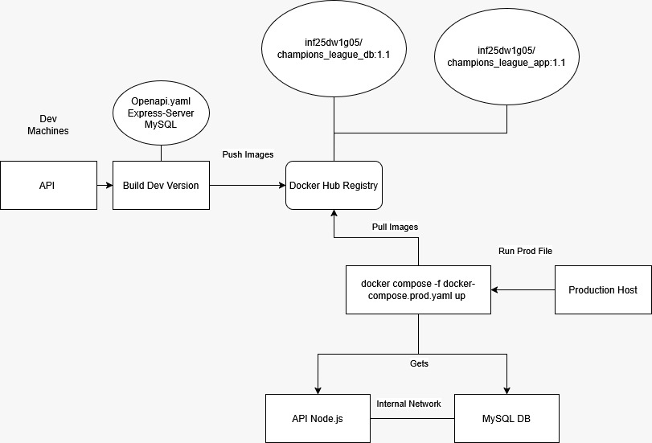

# C3 : Product

*Esta secção descreve o desenvolvimento, instalação e execução do produto.*

## 3.1 Development
Esta secção apresenta, de forma simples e direta, como o projeto **Football Champions League** foi desenvolvido e organizado.

O backend foi construído em **Node.js** com **Express**, apoiado por uma API descrita no ficheiro `openapi.yaml`. A partir dessa definição são gerados automaticamente os controladores, routers e modelos, o que ajuda a manter a implementação coerente com o que está documentado.

A estrutura do código é organizada da seguinte forma:

* **expressServer.js** — ponto de arranque do servidor.
* **Controllers** — tratam cada operação definida na API.
* **Routers** — encaminham os pedidos HTTP para o controlador correto.
* **Models** — representam os dados principais, como equipas, jogadores, jogos e estatísticas.
* **Configuração** — define parâmetros essenciais da aplicação.
* **Logger** — regista pedidos, erros e mensagens úteis para diagnóstico.
* **Ficheiros Docker** — permitem executar o projeto num ambiente isolado.



## 3.2 Instalation
Aqui são descritos os passos necessários para instalar e executar o projeto.

### Execução com Docker

Iniciar o serviço com Docker Compose:

```bash
docker-compose -f src/docker-compose.prod.yaml up
```

## 3.3 Usage

Depois de o servidor estar a funcionar, qualquer cliente HTTP pode utilizar a API. Os endpoints e respetivos parâmetros encontram‑se descritos no ficheiro `openapi.yaml`.

Exemplos de funcionalidades disponíveis:
* Listagem de equipas.
* Consulta de jogos e resultados.
* Acesso a estatísticas gerais.

No estado atual, a API não exige autenticação.

## 3.4 Implementation details

Nesta parte são apresentados os objetivos alcançados e as melhorias adicionadas ao projeto.

### Objetivos mínimos cumpridos
* Implementação da API segundo a especificação OpenAPI.
* Servidor Express funcional.
* Separação clara entre routers, controladores e modelos.
* Sistema de configuração e logging incluídos.

### Elementos de valorização
* Integração com Docker para simplificar a execução em diferentes ambientes.
* Estrutura modular que facilita a manutenção e evolução futura.
* Validações automáticas baseadas no esquema OpenAPI.

### Uso de AI
Ao longo deste projeto viemos a usar inteligência artificial por duas vezes : 
* Nos inserts da nossa base de Dados
* Na query 5 do getStandings 

Em relação aos inserts na base de dados o uso de AI foi uma escolha nossa após decidirmos criar uma "simulação real" de uma verdadeira fase de grupos que no caso occoreu na temporada 2023/2024, para tal após criação das nossas tabelas pedimos a AI de realisar um seed à base de dados por tabela.

Na query 5 do getStandigs o uso de AI surgiu após dificuldade em classificar as equipas mas especificamente no caso em que uma equipa não tenha marcado nem um ponto durante a fase de grupo toda. Surgia nesse preciso caso um output NULL em vez de realmente mostrar que a equipa tinha um total de 0 pontos.

Vamos aqui listar prompts usados no uso de AI:
* "Dá-me a lista dos treinadores destes clubes na época de 2023/2024 e corrige os dados no INSERT INTO team..."
* "Quero que cries inserts para sql para os players seguindo a estrutura: INSERT INTO player (player_id, name, position, nationality, team_id, shirt_number). Faz uma equipa de cada vez, para a época de 2023/2024."
* "Reescreve os inserts de acordo com esta estrutura SQL: CREATE TABLE IF NOT EXISTS player (...), respeitando as chaves estrangeiras e restrições."
* "Quero o plantel completo de cada equipa. Siga para a próxima equipa (Grupo A a H)."
* "Cria inserts para a tabela match tendo em conta as equipas e o ano 2023/2024, seguindo esta estrutura SQL: CREATE TABLE IF NOT EXISTS match (...)."
* "Agora quero a tabela de eventos com esta estrutura: CREATE TABLE IF NOT EXISTS match_event (...), com tipos de eventos 'Goal', 'Yellow Card', 'Red Card', 'Assist'. Cuidado com a restrição dos 90 minutos."
* "Nós queremos goals, yellow cards, red cards e assists de todos os jogos. Analisa websites como flashscore para teres TODOS os dados. Faz grupo a grupo."


---

[< Previous](c2.md) | [^ Main](../../../) | [Next >](c4.md)
:--- | :---: | ---: